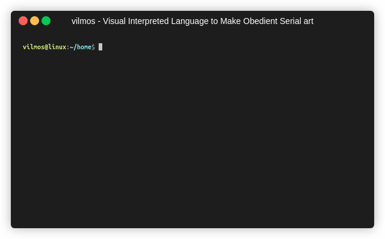
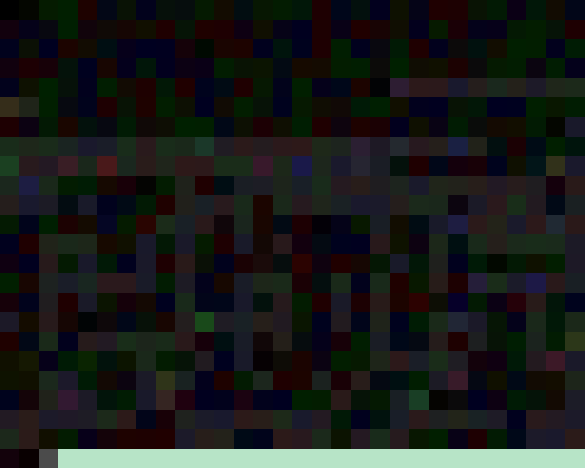
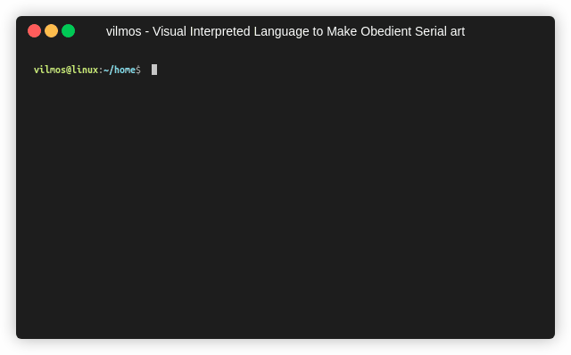

[](https://github.com/Vinetwigs/vilmos)
[](https://github.com/Vinetwigs/vilmos)
[](#license)
[](https://github.com/Vinetwigs/vilmos/issues)

<h1 align="center">vilmos interpreter</h1>

<p align="center">
   <i>
      Official <a href="./docs/LANGUAGE.md">vilmos language</a> interpreter.
      Thanks to this application you will be able to see your paintings 
      come to life. The interpreter offers many useful tools to help your programming sessions!
   </i>
</p>

## Table of Contents

1. [Prerequisites](#prerequisites)
2. [References](#references)
3. [Installing](#installing)
4. [How to use](#how-to-use)
   1. [Get help](#get-help)
   2. [Run a program](#run-a-program)
   3. [Use bigger images](#use-bigger-images)
   4. [Debugger](#debugger)
   5. [Set max memory size](#set-max-memory-size)
5. [Version](#version)
6. [Author](#author)
7. [Contributors](#contributors)
8. [LICENSE](#license)


### References

* [Language Specification](./docs/LANGUAGE.md)
* [Changelog](./docs/CHANGELOG.md)

[Back to top](#table-of-contents)

### Prerequisites

* Make sure you have at least installed `Go v1.17` or your paintings may be blue.
* Knowledge of [vilmos language](./docs/LANGUAGE.md)

[Back to top](#table-of-contents)

### Installing

```
go install github.com/Vinetwigs/vilmos/v2
```

[Back to top](#table-of-contents)

## How to use

### Get help
Use `vilmos help` command to get informations about interpreter usage.



Optionally you can use alternative forms:
* `vilmos -h`
* `vilmos --help`

[Back to top](#table-of-contents)

### Run a program

`vilmos -i <FILE_PATH>` is the easiest way to see your colors in action. Make sure your image is in **.png format**.
By default, each instruction is rapresented by a pixel.

For instance, let's try executing this vilmos program:


This simple program, will output a cool ASCII art. Let's see it in action:


Alternative forms:
* `vilmos --input <FILE_PATH>`

[Back to top](#table-of-contents)

### Use bigger images

The program we used above is really cool in my opinion but it's kind too small.
Let's use a bigger version of the same program to make it more appealing.
In this case, each instruction of our program it is no longer rapresented by a single pixel   
but by a 200x200px square.



Perfect! Now we can clearly see each instruction of our program.

When we will run this program, we have to tell to the interpreter that the size of each instruction is a 200px per side square.
This is easily achievable using `-s <SIZE>` flag.
Full instruction will be `vilmos -s 200 -i ./vilmos_big.png`

Let's see it in action:


Alternative forms:

* `vilmos --instruction_size <SIZE>`
* `vilmos --size <SIZE>`
* `vilmos --is <SIZE>`

[Back to top](#table-of-contents)

### Debugger

Thanks to this useful tools integrated in vilmos interpreter, it is possible to execute our programs   
step by step printing in each step the stack content and a message explaing what the interpreter have done.   
This feature is useful to debug them and find & fix possible bugs.

To enable debugger mode all you need to do is using `-d` flag when running your painting.

This time we will use the following program:


This charming program will simply put into the stack integers from 1 to MAX_INT without outputting anything.   
To see if our program works we will see the stack content through the debugger feature.


Alternative forms:
* `vilmos --debug`

[Back to top](#table-of-contents)

### Set max memory size

The problem with the above program execution is that it will run until it's manually stopped, because   
by default there is no maximum memory size.

To specify a maximum size for the memory usable for your painting execution you have to use `vilmos -m <size>` flag.
Now if you try to put in memory another element when the stack is full, an error will be launched    
and the execution will be stopped.

Let's see it in action setting the max stack size to 200 elements:



Alternative forms:
* `vilmos --max_size <SIZE>`

[Back to top](#table-of-contents)

### Use custom color codes

The true power of vilmos visual language is the capability of setting custom color codes for the instructions.   
This lets you have total control on your Art.

To achieve that, you have to compile a config.ini file provided by this repository.
To compile the configs, you have to specify color codes to override to the relative operation.

**NOTICE:** you can see default instructions color codes in [language specification](./docs/LANGUAGE.md)

The color codes must be in the HEX format (without the #) and there are two supported formats:

1. Full Hex code (a044d1)
2. Short Hex code (fff)

Once you have chosen your favourite colors, you can set custom colors through the following flag:
`vilmos -c <CONFIG_FILE_PATH>`.


For instance, we will override instructions to the image seen above to make it use orange pallette insteand of blue.

New version of out program will be:


And we will compile configs.ini file in the following way to match the colors we have chosen:

```ini
[Colors]
AND=
CYCLE=
DIV=
DUP=ffb732
FILE_CLOSE=
FILE_OPEN=
INPUT_ASCII=
INPUT_INT=
LSHIFT=
MOD=
MUL=
NAND=
NOT=
OR=
OUTPUT=
OUTPUT_ASCII=
OUTPUT_INT=
POP=
QUIT=
RCYCLE=
REVERSE=
RND=
RSHIFT=
SUB=
SUM=ffcb4b
SWAP=
WHILE=ffa300
WHILE_END=ff834b
XOR=
```

Let's see this new version in action:


Alternative forms:
* `vilmos --conf <CONFIG_FILE_PATH>`
* `vilmos --config <CONFIG_FILE_PATH>`

[Back to top](#table-of-contents)

## Version

To print actual vilmos interpreter version you have different choices:
* `vilmos version`
* `vilmos --version`
* `vilmos -V`
* `vilmos -v`

[Back to top](#table-of-contents)

## Author
- [Vinetwigs](https://github.com/Vinetwigs)

[Back to top](#table-of-contents)

## Contributors
<a href="https://github.com/Vinetwigs/vilmos/graphs/contributors">
  
</a>

[Back to top](#table-of-contents)

## License
```text
   Copyright 2021 Vinetwigs

   Licensed under the Apache License, Version 2.0 (the "License");
   you may not use this file except in compliance with the License.
   You may obtain a copy of the License at

       http://www.apache.org/licenses/LICENSE-2.0

   Unless required by applicable law or agreed to in writing, software
   distributed under the License is distributed on an "AS IS" BASIS,
   WITHOUT WARRANTIES OR CONDITIONS OF ANY KIND, either express or implied.
   See the License for the specific language governing permissions and
   limitations under the License.
```

[Back to top](#table-of-contents)